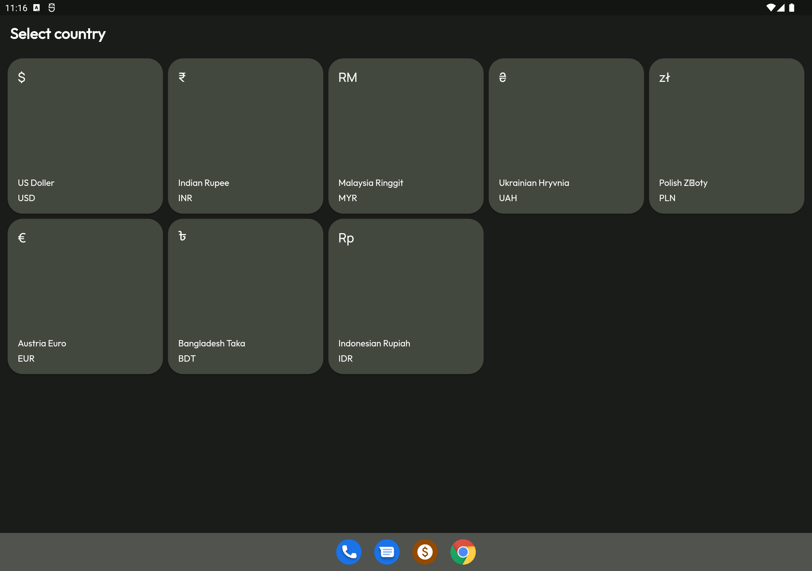
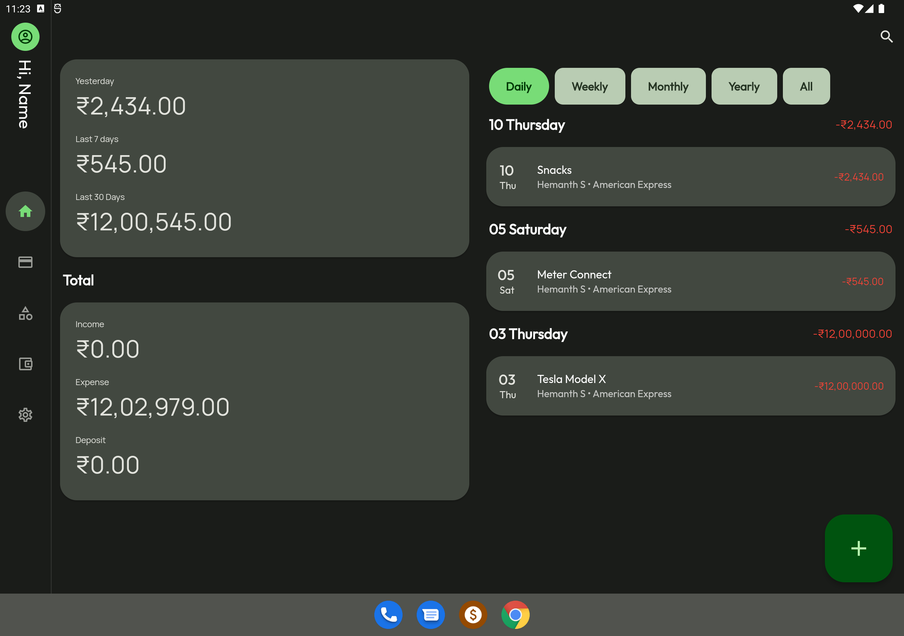
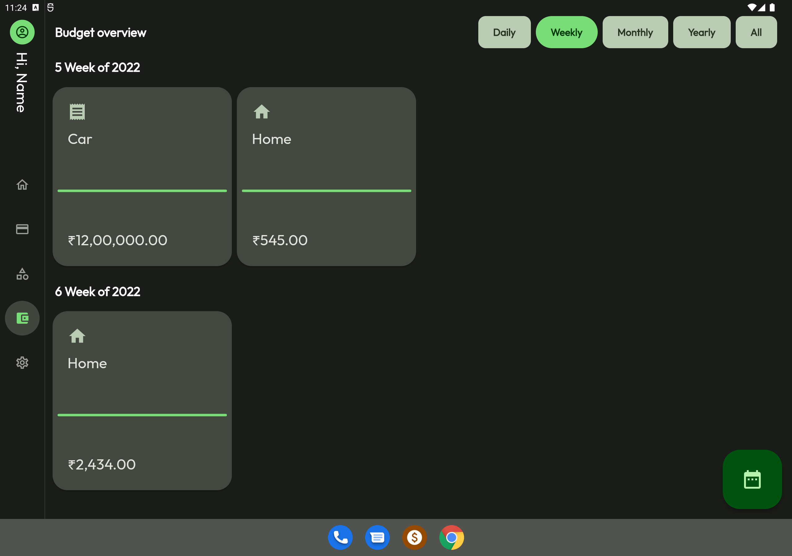

  <a href="https://retromusic.app">
    
    <h1 align="center">Paisa - Expense Tracker</h1>
  </a>

 

   
  

    <h2> Material design expense manager</h2>

### ⚠ Join [@paisa](https://t.me/app_paisa) on Telegram for important updates

### Screen shots

#### Android

|  |  |  |
| :-----------------------------------------------------: | :-----------------------------------------------------: | :-----------------------------------------------------: |
|                          Home                           |                       Categories                        |                        Accounts                         |

#### Tablet

|  |  |  | |
| :-----------------------------------------------------: | :-----------------------------------------------------: | :-----------------------------------------------------: | :-----------------------------------------------------: |
|                          Locale Select                           |                       Account                        |                        Home                         |  Budget Overview                         |

#### Windows

|  |  |  |  |
| :-------------------------------------------------: | :-------------------------------------------------: | :-------------------------------------------------: | :-------------------------------------------------: |
|                        Home                         |                     Categories                      |                       Summary                       |                       Account                       |

Built with fashion of Material Desgin

### Expense Tracking

- Tracking expenses, incomes & deposits
- Account & budget visw overview
- Manage categories

Copyright (c) <2022>, Hemanth S>
All rights reserved.

This source code is licensed under the GPLv3-style license found in the
LICENSE file in the root directory of this source tree.
